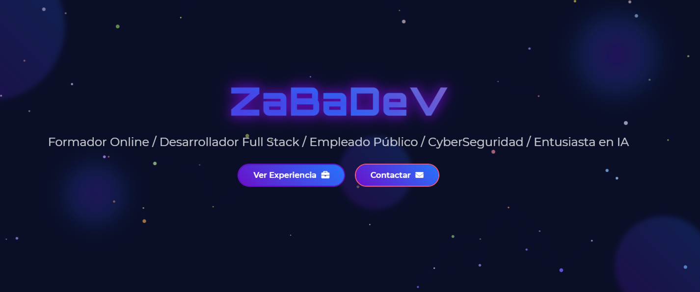

# ZaBaDeV - Portfolio 3D Interactivo

¡Bienvenido al repositorio de mi portfolio personal! Este proyecto es una página web de una sola página (SPA) diseñada para mostrar mis habilidades, experiencia y proyectos de una manera visualmente atractiva e interactiva. El sitio está construido con un enfoque en efectos 3D, animaciones y microinteracciones para crear una experiencia de usuario memorable.



**[➡️ Ver Demo en Vivo](https://zabadev.github.io/Portfolio/)** (¡No olvides reemplazar este enlace con tu URL de GitHub Pages o dominio!)

---

## ✨ Características Principales

*   **Navegación Fija y Fluida**: La barra de navegación superior permanece siempre visible y permite un desplazamiento suave (`smooth scroll`) entre las diferentes secciones.
*   **Fondo de Partículas Interactivo**: Un fondo animado con partículas que reaccionan al movimiento del puntero del ratón, creando un efecto de repulsión.
*   **Efectos 3D con CSS**: Las tarjetas de experiencia, proyectos y educación tienen un efecto de inclinación 3D que responde a la posición del cursor, dándoles profundidad y dinamismo.
*   **Animaciones al Hacer Scroll**: Las secciones aparecen con una sutil animación de entrada a medida que el usuario se desplaza por la página, gracias al uso de `IntersectionObserver`.
*   **Diseño Responsivo**: La interfaz se adapta correctamente a diferentes tamaños de pantalla, desde ordenadores de escritorio hasta dispositivos móviles.
*   **Resaltado de Sección Activa**: El enlace de la sección actual en la barra de navegación se resalta automáticamente para que el usuario sepa en qué parte de la página se encuentra.
*   **Sin Barras de Desplazamiento**: La barra de scroll del navegador está oculta para una apariencia más limpia y moderna, sin perder la funcionalidad de desplazamiento.

---

## 🚀 Tecnologías Utilizadas

Este proyecto fue construido utilizando tecnologías web estándar, sin depender de frameworks complejos.

*   **HTML5**: Para la estructura semántica del contenido.
*   **CSS3**: Para todo el estilizado, incluyendo:
    *   Variables CSS para una fácil personalización de temas.
    *   Flexbox y Grid para el layout.
    *   Transformaciones y transiciones 3D (`perspective`, `rotateX`, `rotateY`).
    *   Animaciones con `@keyframes`.
    *   `backdrop-filter` para efectos de desenfoque (glassmorphism).
*   **JavaScript (ES6+)**: Para toda la lógica e interactividad:
    *   Manipulación del DOM.
    *   Renderizado en Canvas 2D para el fondo de partículas.
    *   Detección de eventos del ratón y scroll.
    *   `IntersectionObserver` para animaciones al desplazar.

### Librerías y Fuentes

*   **Font Awesome**: Para los iconos.
*   **Google Fonts**: Se utilizan las fuentes `Orbitron` y `Roboto` para la tipografía.

---

## 🛠️ Instalación y Uso Local

Si deseas ejecutar este proyecto en tu máquina local, sigue estos sencillos pasos:

1.  **Clona el repositorio:**
    ```bash
    git clone https://github.com/tu-usuario/tu-repositorio.git
    ```

2.  **Navega al directorio del proyecto:**
    ```bash
    cd tu-repositorio
    ```

3.  **Abre el archivo `index.html` en tu navegador:**
    Puedes simplemente hacer doble clic en el archivo `index.html` o usar una extensión como Live Server en Visual Studio Code para verlo con recarga automática.

---

## 📂 Estructura del Proyecto

```
Portfolio/
├── 📄 index.html       # Archivo principal con toda la estructura del contenido.
├── 🎨 styles.css       # Hoja de estilos con todo el diseño y las animaciones.
├── ⚙️ script.js        # Código JavaScript para la interactividad y efectos.
└── 📖 README.md        # Este archivo.
```

---

## ✒️ Autor

*   **Juan José Zabala Rios (ZaBaDeV)**
*   **GitHub**: @ZaBaDeV
*   **LinkedIn**: Juan José Zabala Rios

Hecho con ❤️ por ZaBaDeV.